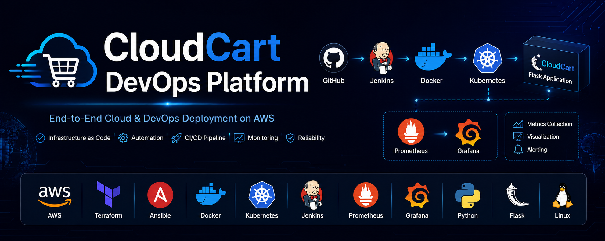
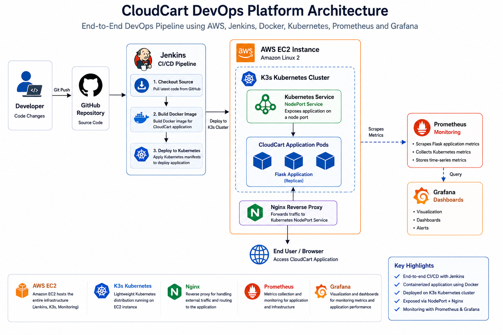
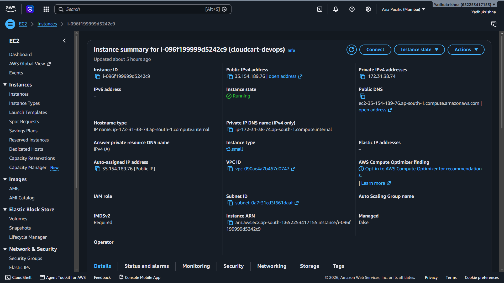
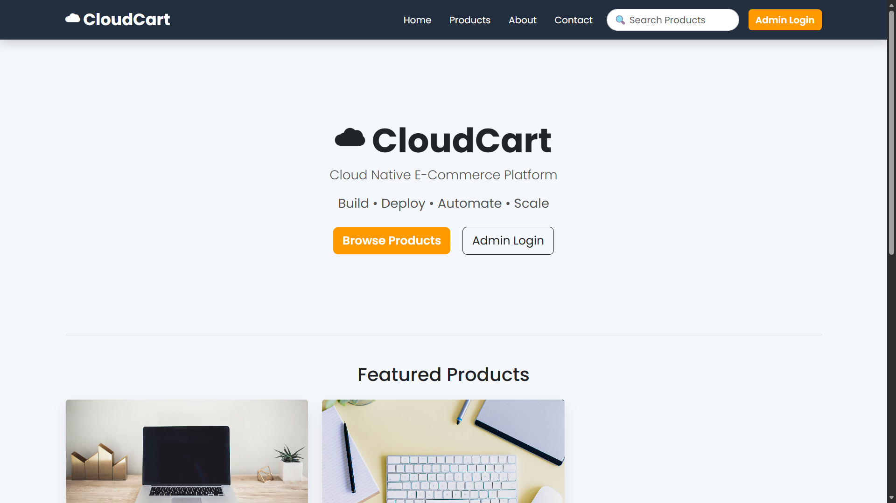
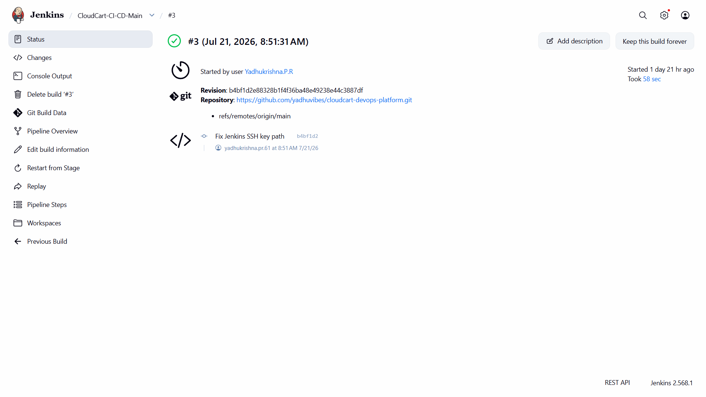
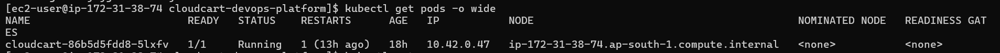
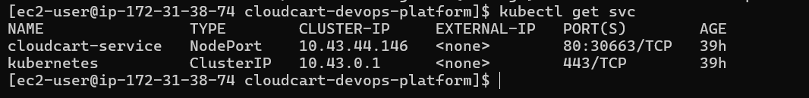
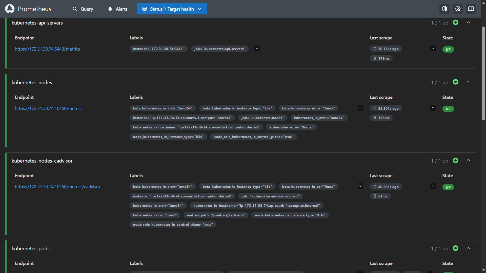
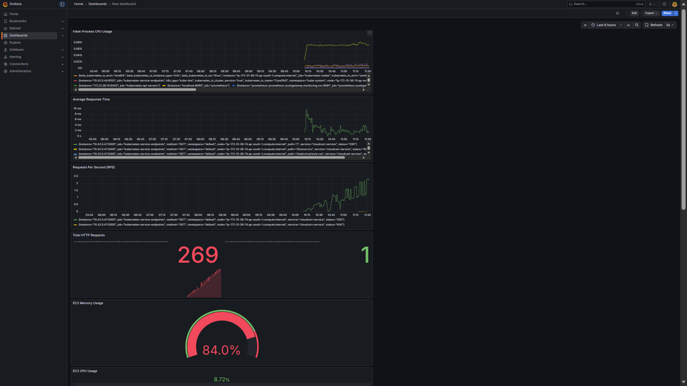
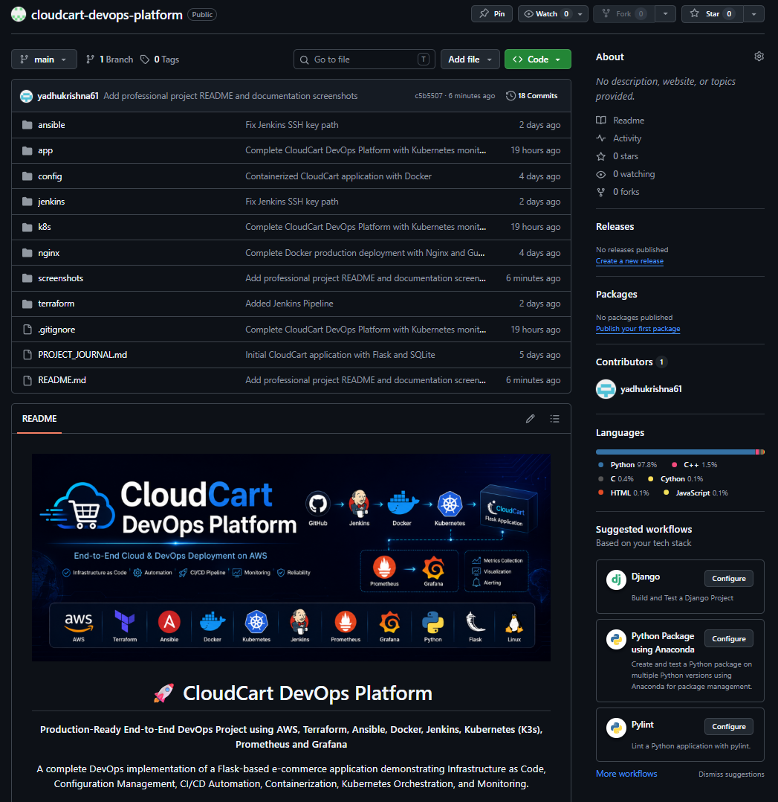

<p align="center">
  
</p>

<h1 align="center">🚀 CloudCart DevOps Platform</h1>

<p align="center">
<b>Production-Ready End-to-End DevOps Project using AWS, Terraform, Ansible, Docker, Jenkins, Kubernetes (K3s), Prometheus and Grafana</b>
</p>

<p align="center">
A complete DevOps implementation of a Flask-based e-commerce application demonstrating Infrastructure as Code, Configuration Management, CI/CD Automation, Containerization, Kubernetes Orchestration, and Monitoring.
</p>

<p align="center">

<a href="#-project-overview">Project Overview</a> •
<a href="#-architecture">Architecture</a> •
<a href="#-technology-stack">Technology Stack</a> •
<a href="#-project-screenshots">Screenshots</a> •
<a href="#-author">Author</a>

</p>

<p align="center">


</p>

---

## 🎯 Project Highlights

- ☁️ Infrastructure Provisioned using **Terraform**
- ⚙️ Configuration Automated using **Ansible**
- 🐳 Containerized using **Docker**
- 🚀 Automated CI/CD with **Jenkins**
- ☸️ Application Deployed on **Kubernetes (K3s)**
- 📊 Real-Time Monitoring using **Prometheus & Grafana**
- 🌐 Reverse Proxy configured using **Nginx**
- 💻 Flask-based E-Commerce Web Application
- 🔄 End-to-End DevOps Workflow on AWS EC2

---

# 📖 Project Overview

CloudCart DevOps Platform is a production-style DevOps project that demonstrates the complete software delivery lifecycle of a Flask-based e-commerce application. The project integrates modern DevOps practices, including Infrastructure as Code (IaC), configuration management, containerization, continuous integration and deployment, Kubernetes orchestration, and monitoring.

The infrastructure is provisioned on an AWS EC2 instance using Terraform, ensuring a repeatable and version-controlled deployment process. Server configuration and software installation are automated with Ansible, eliminating manual setup and improving consistency.

The CloudCart application is containerized using Docker and deployed to a K3s Kubernetes cluster. A Jenkins CI/CD pipeline automates the build and deployment workflow, allowing application updates to be deployed efficiently with minimal manual intervention.

For observability, Prometheus continuously collects application and Kubernetes metrics, while Grafana visualizes them through interactive dashboards, providing real-time monitoring of application health and infrastructure performance.

This project demonstrates practical experience with modern DevOps tools and workflows, making it suitable as a production-inspired portfolio project.

---

# ✨ Key Features

CloudCart DevOps Platform demonstrates a complete DevOps workflow through the following core features:

## ☁ Cloud Infrastructure

- AWS EC2 based deployment
- Infrastructure provisioned using Terraform
- Elastic IP configuration
- IAM role configuration
- Security Group management

---

## ⚙ Configuration Management

- Automated server provisioning with Ansible
- Reusable Ansible roles
- Playbook-driven configuration
- Consistent environment setup

---

## 🐳 Containerization

- Dockerized Flask application
- Lightweight production-ready container
- Dependency management using Docker

---

## ☸ Kubernetes Orchestration

- K3s Kubernetes cluster
- Kubernetes Deployments
- NodePort Service
- Self-healing Pods
- Rolling Updates

---

## 🚀 CI/CD Automation

- Jenkins Pipeline
- GitHub Integration
- Automated Build Process
- Automated Kubernetes Deployment

---

## 📊 Monitoring & Observability

- Prometheus Metrics Collection
- Flask Application Metrics
- Kubernetes Metrics
- Grafana Dashboards
- Real-time Infrastructure Monitoring

---

# 🛠 Technology Stack

The CloudCart DevOps Platform is built using industry-standard DevOps tools and technologies.

| Category | Technology | Purpose |
|-----------|------------|---------|
| ☁ Cloud Platform | AWS EC2 | Hosts the complete DevOps environment |
| 🏗 Infrastructure as Code | Terraform | Automates infrastructure provisioning |
| ⚙ Configuration Management | Ansible | Automates server configuration |
| 🐳 Containerization | Docker | Packages the Flask application into containers |
| ☸ Container Orchestration | Kubernetes (K3s) | Deploys and manages application containers |
| 🚀 CI/CD | Jenkins | Automates build and deployment pipeline |
| 🌐 Reverse Proxy | Nginx | Routes external traffic to the application |
| 📊 Monitoring | Prometheus | Collects application and Kubernetes metrics |
| 📈 Visualization | Grafana | Displays monitoring dashboards |
| 💻 Backend Framework | Flask | Python-based web application |
| 🗄 Database | SQLite | Stores application data |
| 📝 Version Control | Git & GitHub | Source code management and collaboration |

---

# 🏗 Architecture

<p align="center">
  
</p>

The CloudCart DevOps Platform follows a complete end-to-end DevOps workflow, beginning with source code management and ending with real-time monitoring.

## 🚀 Workflow

```text
Developer
    │
    ▼
GitHub Repository
    │
    ▼
Jenkins CI/CD Pipeline
    │
    ▼
Docker Image Build
    │
    ▼
Kubernetes (K3s Cluster)
    │
    ▼
Nginx Reverse Proxy
    │
    ▼
CloudCart Flask Application
    │
    ▼
Prometheus Monitoring
    │
    ▼
Grafana Dashboard
```

## 🔄 Workflow Explanation

1. Developers push the latest application code to the GitHub repository.

2. Jenkins detects the new changes and starts the CI/CD pipeline.

3. Jenkins builds a fresh Docker image for the Flask application.

4. The updated application is deployed to the K3s Kubernetes cluster.

5. Kubernetes manages the application Pods and ensures high availability through self-healing and rolling updates.

6. Nginx acts as the reverse proxy and forwards incoming client requests to the running application.

7. Prometheus continuously collects metrics from both the Flask application and the Kubernetes cluster.

8. Grafana visualizes these metrics through interactive dashboards, enabling real-time monitoring of application and infrastructure health.

---

# 📂 Project Structure

```text
cloudcart-devops-platform/
│
├── app/                    # Flask application source code
│   ├── static/
│   ├── templates/
│   ├── app.py
│   ├── models.py
│   └── requirements.txt
│
├── terraform/              # Infrastructure as Code (AWS)
│
├── ansible/                # Configuration Management
│
├── docker/                 # Docker configuration
│
├── jenkins/                # Jenkins Pipeline
│
├── k8s/                    # Kubernetes manifests
│
├── nginx/                  # Reverse proxy configuration
│
├── scripts/                # Deployment & utility scripts
│
├── screenshots/            # Project screenshots
│
├── documentation/          # Project documentation
│
├── PROJECT_JOURNAL.md
│
├── README.md
│
└── .gitignore
```

The repository is organized into separate modules for infrastructure provisioning, automation, application deployment, monitoring, and documentation. This modular structure improves maintainability and makes each component easy to understand and extend.

---

# ☁ Infrastructure Overview

The CloudCart DevOps Platform is hosted on an **AWS EC2** instance, where all DevOps components are deployed and managed. Infrastructure provisioning is automated using **Terraform**, ensuring a repeatable and version-controlled deployment process.

## Infrastructure Components

- Amazon EC2 Instance
- Elastic IP
- Security Groups
- IAM Configuration
- Amazon Linux
- K3s Kubernetes Cluster

Terraform enables infrastructure to be provisioned consistently, reducing manual configuration and making deployments easier to reproduce.

---

# ⚙ Configuration Management

After infrastructure provisioning, **Ansible** is used to automate server configuration and software installation.

## Configuration Tasks

- Server provisioning
- Package installation
- Environment configuration
- Deployment automation
- Reusable Ansible roles

This eliminates repetitive manual setup and ensures a consistent server configuration.

---

# 🚀 CI/CD Pipeline

Continuous Integration and Continuous Deployment are implemented using **Jenkins**.

## Pipeline Workflow

```text
GitHub Push
      │
      ▼
Jenkins Pipeline
      │
      ▼
Build Docker Image
      │
      ▼
Deploy to Kubernetes
      │
      ▼
Verify Deployment
```

### Pipeline Stages

- Checkout source code from GitHub
- Build Docker image
- Deploy updated application to Kubernetes
- Verify successful deployment

The Jenkins pipeline automates application delivery, making deployments faster and more reliable.

---

# ☸ Kubernetes Deployment

The CloudCart application runs on a **K3s Kubernetes cluster**.

## Kubernetes Resources

- Deployment
- NodePort Service
- Replica Management
- Self-Healing Pods
- Rolling Updates

Kubernetes ensures that application containers remain available and automatically recovers failed Pods when necessary.

---

# 📊 Monitoring & Observability

Application and infrastructure monitoring are implemented using **Prometheus** and **Grafana**.

## Prometheus

Prometheus continuously collects metrics including:

- Flask Application Metrics
- HTTP Request Metrics
- Response Time
- Kubernetes Metrics

## Grafana

Grafana visualizes collected metrics through dashboards, including:

- Application Availability
- HTTP Request Count
- CPU Utilization
- Memory Usage
- Kubernetes Cluster Metrics

Together, Prometheus and Grafana provide real-time visibility into the health and performance of the CloudCart platform.

---


# 📸 Project Screenshots

The following screenshots demonstrate the successful implementation of the CloudCart DevOps Platform.

---

## ☁ AWS EC2 Instance

Infrastructure hosting the complete DevOps environment.

<p align="center">

</p>

---

## 🚀 CloudCart Application

Flask-based e-commerce application running on Kubernetes.

<p align="center">

</p>

---

## ⚙ Jenkins Dashboard

CI/CD pipeline responsible for automated application deployment.

<p align="center">

</p>

---

## ☸ Kubernetes Deployment

Application Pods successfully running inside the K3s cluster.

<p align="center">

</p>

---

## 🌐 Kubernetes Services

NodePort service exposing the CloudCart application.

<p align="center">

</p>

---

## 📈 Prometheus Monitoring

Prometheus successfully scraping application and Kubernetes metrics.

<p align="center">

</p>

---

## 📊 Grafana Dashboard

Real-time visualization of infrastructure and application metrics.

<p align="center">

</p>

---

## 📁 GitHub Repository

The complete source code, infrastructure automation, Kubernetes manifests, CI/CD pipeline, monitoring configuration, and documentation are available in this GitHub repository.

<p align="center">
  
</p>


---

# 🚀 Future Enhancements

The following improvements can further enhance the CloudCart DevOps Platform:

- 🔒 HTTPS integration using Let's Encrypt
- ☸ Multi-node Kubernetes Cluster
- 📈 Horizontal Pod Autoscaling (HPA)
- 🗄 Migration from SQLite to MySQL/PostgreSQL
- 📦 Container image registry integration
- 📋 Centralized logging using the ELK Stack
- ☁ Deployment on Amazon EKS
- 🔄 GitOps-based deployments using ArgoCD

---

# 👨‍💻 Author

## Yadhukrishna PR

Cloud & DevOps Engineer

📍 Thrissur, Kerala, India

📧 **Email:** yadhukrishna.pr.60@gmail.com

🐙 **GitHub:** https://github.com/yadhuvibes

💼 **LinkedIn:** https://linkedin.com/in/yadhukrishna-p-r-53a9b

---

If you found this project helpful, feel free to ⭐ the repository.

---

# 📜 License

This project has been developed for educational, learning, and portfolio purposes.

© 2026 Yadhukrishna PR

---
